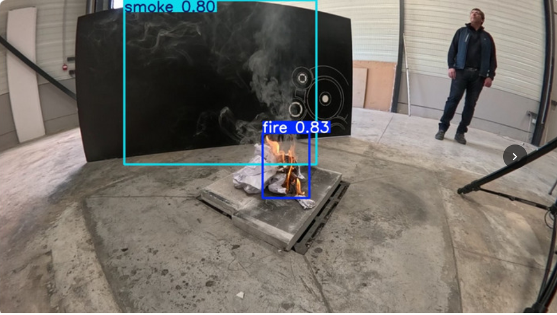
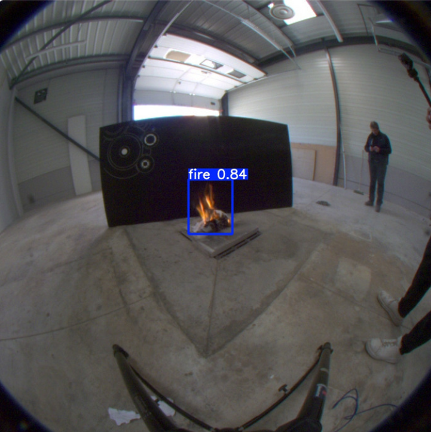
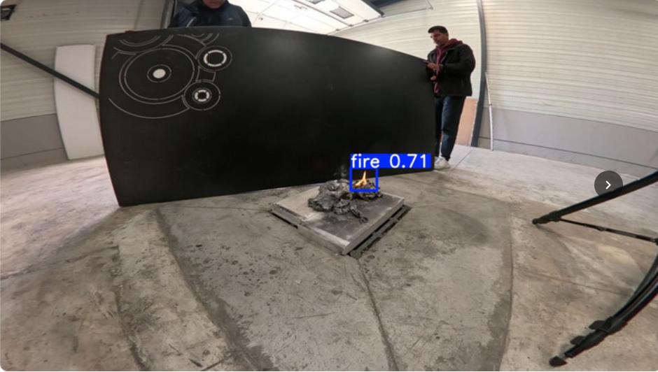

# Indoor Fire & Smoke Detection -- Fisheye Lens

**RT-DETR-L + RectConv** | Real-time fire and smoke detection optimised for fisheye security cameras

<p align="center">
  
</p>

Two detection classes: **fire** and **smoke**.
Best model achieves **mAP@50 = 0.923** on the cylindrical joint validation set.

---

## Table of Contents

- [Why This Project](#why-this-project)
- [Methodology](#methodology)
  - [The Problem: Fisheye Distortion Breaks Standard Detectors](#the-problem-fisheye-distortion-breaks-standard-detectors)
  - [RectConv: Geometry-Aware Convolutions](#rectconv-geometry-aware-convolutions)
  - [RT-DETR-L: Vision Transformer Detector](#rt-detr-l-vision-transformer-detector)
  - [Dataset Preparation: Cylindrical Joint Pipeline](#dataset-preparation-cylindrical-joint-pipeline)
  - [Full Pipeline Overview](#full-pipeline-overview)
- [Example Detections](#example-detections)
- [Results](#results)
- [Quick Start](#quick-start)
  - [Installation](#installation)
  - [Prepare the Dataset](#prepare-the-dataset)
  - [Fine-Tune the Model](#fine-tune-the-model)
  - [Run the Streamlit GUI](#run-the-streamlit-gui)
- [Repository Layout](#repository-layout)
- [Camera Calibration](#camera-calibration)
- [Citation](#citation)

---

## Why This Project

Fisheye security cameras provide 180-degree coverage of indoor spaces -- ideal for fire safety monitoring. But their extreme radial distortion breaks standard object detectors: flames and smoke near the image edges appear warped, stretched, and scaled differently than at the centre.

This project solves that problem by combining:
1. **RectConv** -- convolutions that correct for fisheye distortion at the kernel level
2. **RT-DETR-L** -- a state-of-the-art vision transformer detector that naturally handles the non-uniform spatial features produced by RectConv

The result: a detector that runs directly on raw fisheye frames with no global rectification, no dead zones, and no coordinate back-projection.

---

## Methodology

### The Problem: Fisheye Distortion Breaks Standard Detectors

Standard CNNs assume **translation invariance**: the same feature (an edge, a flame texture) should activate the same filter no matter where it appears. This holds for pinhole cameras but fails for fisheye lenses.

A 180-degree fisheye lens compresses and rotates objects progressively toward the edges. A flame at the image centre looks sharp and upright; the same flame near the periphery is warped beyond recognition for a standard convolution kernel. Traditional fixes (global rectification, cylindrical unwrapping) sacrifice field of view or introduce large dead zones.

### RectConv: Geometry-Aware Convolutions

**RectConv** ([arXiv:2404.08187](https://arxiv.org/abs/2404.08187)) solves this at the convolution level by modifying how each kernel samples its neighbourhood:

```
Standard Conv2d:
  For each output position p, sample a regular K x K grid around p.

RectifyConv2d:
  For each output position p, compute the locally perspective-corrected
  K x K sampling grid using the camera's radial distortion model,
  then bilinearly interpolate at those (non-integer) locations.
```

Every convolution kernel sees a **locally rectified patch** -- a small neighbourhood that looks like a perspective view regardless of where it sits in the fisheye frame.

| Property | Benefit |
|---|---|
| Full 180-degree FOV preserved | No dead zones, no cropping |
| Model weights unchanged | COCO-pretrained weights work out of the box |
| Detections in native fisheye coordinates | No post-processing back-projection needed |
| Offset map computed once per camera | Negligible runtime overhead per frame |

The distortion offset map uses the **Kannala-Brandt equidistant model**:

```
r = k1 * theta      (k1 = r_max / (FOV_rad / 2))
```

It is computed once from the camera's FOV (or a calibration JSON) and cached to `cameras/cache/`.

#### How Model Patching Works

After loading RT-DETR-L, every `nn.Conv2d` with kernel size > 1 is replaced in-place with a `RectifyConv2d` carrying the precomputed offset map:

```python
from scripts.rectconv_adapter import make_camera_from_fov, build_distortion_map, patch_model

cam     = make_camera_from_fov(w=640, h=640, fov_deg=180)
distmap = build_distortion_map(cam, cache_path="cameras/cache")
patch_model(model.model, distmap)   # modifies the nn.Module in-place
```

### RT-DETR-L: Vision Transformer Detector

We use **RT-DETR-L** (Real-Time Detection Transformer, Large variant) as the base detector. RT-DETR is a hybrid CNN-Transformer architecture:

- **ResNet-50 backbone** extracts multi-scale features
- **Hybrid encoder** combines CNN efficiency with Transformer self-attention
- **DETR-style decoder** with learnable object queries and bipartite matching loss
- Pre-trained on **COCO 2017** (80 classes, perspective images)
- Input resolution: **640 x 640**

**Why RT-DETR over YOLO for fisheye?**

| Advantage | Explanation |
|---|---|
| Self-attention | Naturally adapts to the spatially non-uniform features produced by RectConv -- attention weights learn where to focus regardless of geometric irregularities |
| No anchor tuning | DETR-style bipartite matching is agnostic to object size/aspect-ratio distributions, which vary wildly across the fisheye frame |
| End-to-end | No NMS post-processing, which can struggle with the unusual bounding box overlaps fisheye geometry produces |

### Dataset Preparation: Cylindrical Joint Pipeline

We built a joint dataset from three sources to maximise diversity:

| Source | Type | Processing |
|---|---|---|
| DS1 -- Fisheye Fire 1024 | fisheye 1024x1024, 180-degree FOV | Cylindrical warp to 640x640 |
| DS3 -- Fisheye Fire/Smoke 1280 | fisheye 1280x960, 180-degree FOV | Cylindrical warp to 640x640 |
| DS2 -- Indoor Fire Smoke | perspective 640x640 | Copied as-is |

The cylindrical projection pipeline (`scripts/train_cylindrical_joint.py`):

1. Estimates equidistant calibration from image dimensions
2. Builds `cv2.remap()` backward lookup tables for 640x640 output
3. Warps each image with bilinear interpolation
4. Transforms YOLO bounding boxes via **8-point sampling** (4 corners + 4 edge midpoints)
5. Drops boxes where fewer than 2 of 8 points remain within the valid fisheye circle

All images are shuffled (seed=42) and split **85% train / 15% val**.

### Full Pipeline Overview

```
Raw fisheye images (DS1, DS3)
    |
    v  fisheye -> cylindrical projection  (train_cylindrical_joint.py)
    |    equidistant remap, 8-point bbox transform, 85/15 split
    v
datasets/cylindrical_joint/   <-- DS2 perspective images merged in
    |
    v  Build RectConv offset map           (rectconv_adapter.py)
    |    equidistant camera model, 640x640, cached to cameras/cache/
    v
RT-DETR-L loaded  (rtdetr-l.pt, COCO pretrained)
    |
    v  Patch all Conv2d -> RectifyConv2d   (rectconv_adapter.patch_model)
    |    weights preserved, sampling grids corrected for fisheye geometry
    v
Fine-tune on cylindrical_joint             (train_rtdetr_rectconv.py)
    |    epochs=20, batch=4, imgsz=640
    |    HSV jitter, mosaic, mixup, rotation, flips
    |    warmup 3 epochs, cosine LR decay, early stopping patience=15
    v
whights/rtdetr-l-rectconv_v1_2026-04-02.pt   <- best checkpoint (mAP@50: 0.923)
```

---

## Example Detections

All examples are from real fisheye security camera frames processed by the trained RT-DETR-L + RectConv model via the Streamlit GUI.

### Fire Detection -- Image Centre

<p align="center">
  
</p>

Fire detected at the image centre with **84% confidence**. The fisheye distortion is minimal here, and the model produces a tight bounding box around the flame.

### Fire Detection -- Image Periphery

<p align="center">
  
</p>

Fire detected near the image edge with **71% confidence**. Despite significant fisheye distortion at the periphery, RectConv's geometry-corrected sampling allows the detector to correctly identify the small flame. This is the scenario where standard detectors typically fail.

### Fire + Smoke Detection

<p align="center">
  
</p>

Both classes detected simultaneously: **fire at 83%** and **smoke at 80%** confidence. The model correctly distinguishes the two classes and localises them with separate bounding boxes even under fisheye distortion.

---

## Results

**Run:** `rtdetr-l-rectconv_v1_2026-04-02` | 20 epochs | batch 4 | 640x640

| Metric | Best Value |
|---|---|
| **mAP@50** | **0.923** |
| **mAP@50-95** | **0.556** |
| Precision | 0.896 |
| Recall | 0.881 |

<details>
<summary>Epoch-by-epoch metrics</summary>

| Epoch | mAP@50 | mAP@50-95 | Precision | Recall |
|---|---|---|---|---|
| 1 | 0.458 | 0.215 | 0.593 | 0.461 |
| 2 | 0.698 | 0.334 | 0.756 | 0.636 |
| 3 | 0.755 | 0.378 | 0.776 | 0.694 |
| 4 | 0.801 | 0.402 | 0.812 | 0.737 |
| 5 | 0.818 | 0.399 | 0.826 | 0.758 |
| 6 | 0.833 | 0.416 | 0.844 | 0.768 |
| 7 | 0.848 | 0.443 | 0.835 | 0.799 |
| 8 | 0.853 | 0.437 | 0.838 | 0.804 |
| 9 | 0.873 | 0.456 | 0.854 | 0.822 |
| 10 | 0.871 | 0.451 | 0.869 | 0.807 |
| 11 | 0.900 | 0.500 | 0.890 | 0.829 |
| 12 | 0.890 | 0.503 | 0.878 | 0.845 |
| 13 | 0.908 | 0.509 | 0.893 | 0.852 |
| 14 | 0.908 | 0.523 | 0.885 | 0.867 |
| 15 | 0.911 | 0.522 | 0.894 | 0.866 |
| **16** | **0.923** | 0.546 | **0.911** | 0.863 |
| 17 | 0.918 | 0.555 | 0.899 | 0.865 |
| 18 | 0.922 | **0.556** | 0.900 | 0.875 |
| 19 | 0.918 | 0.553 | 0.900 | 0.875 |
| 20 | 0.921 | 0.553 | 0.896 | **0.881** |

</details>

Key observations:
- **Epoch 1-4**: Rapid transfer learning -- mAP@50 jumps from 0.46 to 0.80 in 4 epochs
- **Epoch 10-11**: Sharp improvement (+0.029 mAP@50) when mosaic augmentation disables (`close_mosaic=10`)
- **Epoch 16+**: mAP@50 plateaus at 0.92+ while mAP@50-95 continues climbing (better localisation precision)
- No sign of overfitting across 20 epochs

---

## Quick Start

### Installation

```bash
git clone https://github.com/medlemine-djeidjah/Indoor-Fire-Detection-Fisheye-Lens
cd Indoor-Fire-Detection-Fisheye-Lens
```

```bash
python -m venv venv
source venv/bin/activate      # Linux/Mac
# venv\Scripts\activate       # Windows
```

```bash
pip install ultralytics opencv-python torch torchvision streamlit pillow numpy scipy
```

The `third_party/RectConv/` directory is included. If missing:

```bash
git clone https://github.com/RoboticImaging/RectConv.git third_party/RectConv
```

### Prepare the Dataset

Build the cylindrical joint dataset from your raw fisheye and perspective sources:

```bash
python scripts/train_cylindrical_joint.py \
    --ds1 /path/to/fisheye-fire-1024 \
    --ds2 /path/to/indoor-fire-smoke-perspective \
    --ds3 /path/to/fisheye-fire-smoke-1280 \
    --output-dataset datasets/cylindrical_joint \
    --hfov 160 --vfov 120 \
    --prepare-only
```

This warps fisheye images to cylindrical 640x640, transforms bounding boxes, merges with perspective data, and creates an 85/15 train/val split.

### Fine-Tune the Model

#### Basic: estimate camera from FOV (no calibration needed)

```bash
python scripts/train_rtdetr_rectconv.py \
    --data datasets/cylindrical_joint/data.yaml \
    --fov 180 --width 640 --height 640 \
    --epochs 50 --batch 8
```

This will:
1. Load RT-DETR-L with COCO-pretrained weights (`rtdetr-l.pt`, auto-downloaded)
2. Compute the RectConv distortion offset map for a 180-degree equidistant lens
3. Patch all `Conv2d` layers to `RectifyConv2d`
4. Fine-tune on your dataset with augmentations (mosaic, mixup, HSV jitter, flips)
5. Save the best weights to `whights/rtdetr-l-rectconv_v{N}_{date}.pt`

#### Advanced: with a calibrated camera JSON

```bash
python scripts/train_rtdetr_rectconv.py \
    --data datasets/cylindrical_joint/data.yaml \
    --camera-json cameras/default_180fov.json \
    --epochs 50 --batch 8 --device 0
```

#### Multiple datasets

```bash
python scripts/train_rtdetr_rectconv.py \
    --data /path/ds_A/data.yaml /path/ds_B/data.yaml \
    --fov 180 --epochs 50 --device 0
```

Training outputs (curves, confusion matrices, weight snapshots) are saved to `training_results/`.

### Run the Streamlit GUI

```bash
streamlit run gui/app.py
```

Open `http://localhost:8501` in your browser.

| Tab | What it does |
|---|---|
| **Model Upload** | Load any `.pt`, `.onnx`, or `.engine` weights file |
| **Image Analysis** | Upload a fisheye image, run inference, see detections with bounding boxes |
| **Live Camera** | Connect to an IP camera or webcam for real-time detection |

Adjustable confidence threshold (default 0.45) and IOU threshold (default 0.70) via the sidebar.

---

## Repository Layout

```
.
├── cameras/
│   ├── default_180fov.json           # Equidistant 180-degree camera config
│   └── cache/                        # Cached RectConv offset maps (.pt)
│
├── datasets/
│   └── cylindrical_joint/            # Prepared training dataset (gitignored)
│       ├── data.yaml                 # nc: 2, names: ['fire', 'smoke']
│       ├── train/images/ & labels/
│       └── val/images/   & labels/
│
├── gui/
│   └── app.py                        # Streamlit web application
│
├── imgs/                             # Example detection screenshots
│
├── scripts/
│   ├── train_rtdetr_rectconv.py      # Main training script (RT-DETR-L + RectConv)
│   ├── rectconv_adapter.py           # RectConv <-> Ultralytics bridge
│   ├── train_cylindrical_joint.py    # Dataset preparation (cylindrical warp)
│   ├── fisheye_rectifier.py          # Calibration-free fisheye rectifier
│   └── merge_dataset.py             # Utility: merge external datasets
│
├── third_party/
│   └── RectConv/                     # RectConv library (RoboticImaging/RectConv)
│
├── training_results/                 # Training run outputs (curves, weights, plots)
│
├── whights/
│   ├── registry.json                 # Model registry (id, date, metrics)
│   └── rtdetr-l-rectconv_v1_*.pt     # Best trained weights
│
├── rtdetr-l.pt                       # Base RT-DETR-L (COCO pretrained, 64 MB)
└── .streamlit/config.toml            # Fire-orange UI theme
```

---

## Datasets

### Available Datasets

| Dataset | Description | Classes |
|---------|-------------|---------|
| **Indoor-Fire-Smoke** | Indoor fire and smoke images (perspective) | fire, smoke |
| **Fisheye-Lens-Images** | Fisheye distorted fire images | fire |
| **Indoor-Outdoor-Dataset** | Mixed indoor/outdoor fire scenes | fire, smoke |
| **Building-Out** | Building fire scenarios | fire, smoke |

### Download Links

| Dataset | Link |
|---------|------|
| Indoor-Fire-Smoke | [Zenodo](https://zenodo.org/records/15826133/files/Indoor%20Fire%20Smoke.zip?download=1) |
| Building-Out | [Zenodo](https://zenodo.org/records/15187630/files/Building_Out.zip?download=1) |

Place downloaded datasets in the `datasets/` directory and rename if needed:

```bash
unzip "Indoor Fire Smoke.zip" -d datasets/
mv "datasets/Indoor Fire Smoke" datasets/Indoor-Fire-Smoke
```

---

## Camera Calibration

The equidistant approximation works for most wide-angle IP cameras. For better accuracy, provide a calibration JSON.

Generate a template:

```bash
python scripts/rectconv_adapter.py \
    --gen-json --fov 180 --width 640 --height 640 \
    --output cameras/my_camera.json
```

Replace `k1` (and optionally `k2`-`k4`) with values from your calibration tool (OpenCV, MATLAB, Kalibr).

```json
{
  "intrinsic": {
    "k1": 203.7, "k2": 0.0, "k3": 0.0, "k4": 0.0,
    "width": 640, "height": 640,
    "cx_offset": 0.0, "cy_offset": 0.0, "aspect_ratio": 1.0
  },
  "extrinsic": {
    "quaternion": [0, 0, 0, 1],
    "translation": [0, 0, 0]
  }
}
```

---

## Requirements

- Python 3.8+
- CUDA-capable GPU (recommended for training; CPU works for inference)
- `ultralytics`, `opencv-python`, `torch`, `torchvision`, `streamlit`, `pillow`, `numpy`, `scipy`

---

## Citation

If you use this work, please cite the RectConv paper:

```bibtex
@article{rectconv2024,
  title   = {Adapting CNNs for Fisheye Cameras without Retraining},
  author  = {RoboticImaging lab},
  year    = {2024},
  url     = {https://arxiv.org/abs/2404.08187}
}
```
